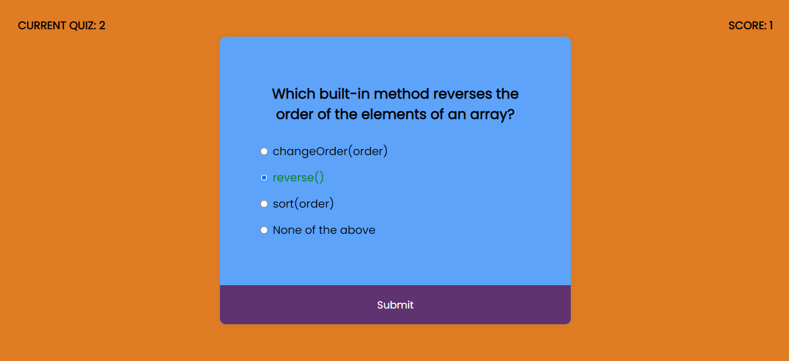
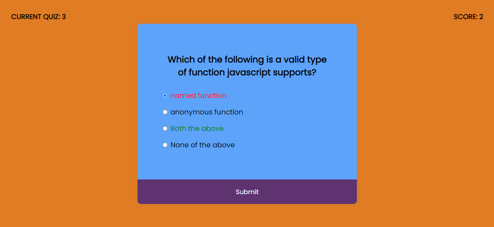

# PRANAV MATHUR

## Learnings from the project:

- Working with Callback functions like **setTimeout()**
- ES6+ keywords like _for-of loop_, _template literals_, _arrow functions_ etc

## Time taken:

    It took me 10 hours to complete this project.

## Screenshots:

## Live link:

[Go to site](https://14-js-quiz.netlify.app/)
